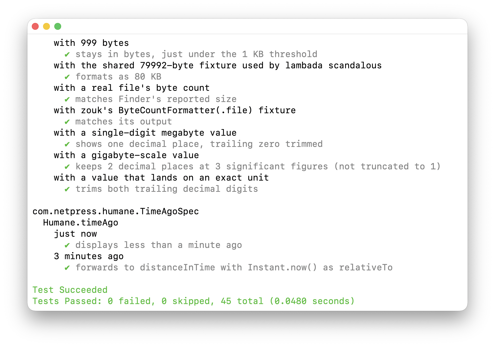

# kotidy

[](build.gradle.kts)
[](https://github.com/woodie/kotidy/actions/workflows/CI.yml)
[](https://github.com/woodie/kotidy/releases/latest)
[](LICENSE)



RSpec style output for Kotest's `DescribeSpec`, via a real Gradle plugin --
no CLI wrapper or text-output parsing required.

`kotidy` hooks Gradle's own `TestListener` API directly and walks the real
nested `TestDescriptor.parent` chain Kotest's `DescribeSpec`/Gradle's JUnit
Platform integration already carry, re-rendering it as a dense, deduped tree
with no blank-line padding between `describe`/`context` groups. No raw test
output to parse -- Kotest's own spec tree is already structured, so `kotidy`
reads it straight from the Gradle API.

## Installation

Published and approved on the [Gradle Plugin Portal](https://plugins.gradle.org/plugin/com.netpress.kotidy):

```kotlin
plugins {
    id("com.netpress.kotidy") version "0.1.0"
}
```

with `gradlePluginPortal()` in your `pluginManagement.repositories`. That's
it -- every `Test` task in the project gets the tree renderer
automatically, no further wiring needed.

## Usage

```kotlin
kotidy {
    style = "fd" // classic (default), fd, fs, or fv
}
```

Or override at runtime without touching `build.gradle.kts`:

```
./gradlew test -Dkotidy.style=fd
```

## Output styles

Four named styles:

| `style` | Convention | Look |
|---|---|---|
| `classic` (default) | Our base formatter | Glyph + `name (N seconds)`, failures add `(FAILED - N)` |
| `fd` | RSpec's doc format | Plain colored name, yellow `(PENDING)` for skips |
| `fs` | Mocha's spec format | Green `✔` + gray name, red `✗ name (FAILED - N)` |
| `fv` | Vitest's own tree | Green `✓ name`, two-toned green `2ms`, red `× name`, dim gray `↓ name` |

The first three end with a verdict + counts footer (`Test Succeeded`/
`Tests Passed: 0 failed, 0 skipped, 45 total (0.057 seconds)`); `fv` ends
with Vitest's own `Test Files`/`Tests`/`Duration` footer instead,
right-justified the same way. `Test Files` counts distinct top-level spec
classes.

## Why not an existing plugin

Two real candidates exist on the Gradle side, and neither covers this gap:

[`gradle-test-logger-plugin`](https://github.com/radarsh/gradle-test-logger-plugin)
gives real nested indentation with checkmarks via its `mocha` theme, but
inserts a blank line between every `describe`/`context` group with no
config flag to disable it -- confirmed still true as of its current README.
It also has no RSpec-doc-style (no-glyph) or Vitest-tree equivalent.

[`kotest-gradle-plugin`](https://github.com/kotest/kotest-gradle-plugin)
(`io.kotest`, alpha) solves a different problem: Gradle's own JUnit Platform
integration flattens nested Kotest names to leaf-only in its build output and
reports, and this plugin replaces the whole test-running task (its own
`kotest` task, not `test`) to recover the real names. It doesn't offer style
switching, and swapping the test task itself is a bigger commitment than a
`TestListener` add-on.

## Writing tests

`kotidy`'s own formatting logic (`Styles.kt`) has no Gradle API dependency --
it's tested directly with Kotest's `DescribeSpec`, using the same
`describe`/`context`/`it` structure and a `subject`/`beforeEach` pattern for
shared setup. `KotidyPlugin.kt` itself (the `TestListener` wiring) isn't
unit-tested the same way -- verifying it means actually applying the plugin
in a consuming project and reading real console output.

## Limitations

- Tree order follows completion order, which matches declaration order for
  serial tests but can reorder under parallel test execution.
- `fv`'s per-leaf millisecond timing is only as precise as Gradle's own
  `TestResult` start/end timestamps -- sub-millisecond tests will round.
- `make build`/`test`/`check` render kotidy's own suite with Gradle's plain
  default output, not kotidy's own tree -- applying the plugin to its own
  in-progress build isn't possible mid-compile. `make dogfood` applies
  the last-published Portal version instead, just to capture
  `docs/example.png`.

## Development

```
make build    # ./gradlew ktlintFormat && ./gradlew build -x test
make test     # ./gradlew ktlintFormat && ./gradlew clean test
make lint     # ./gradlew ktlintCheck
make check    # ./gradlew ktlintFormat && ./gradlew clean check
make dogfood  # ./gradlew clean test -Pdogfood -- renders this repo's own
              # suite through the last-published Portal version, for
              # docs/example.png only (see "Limitations" above)
```
